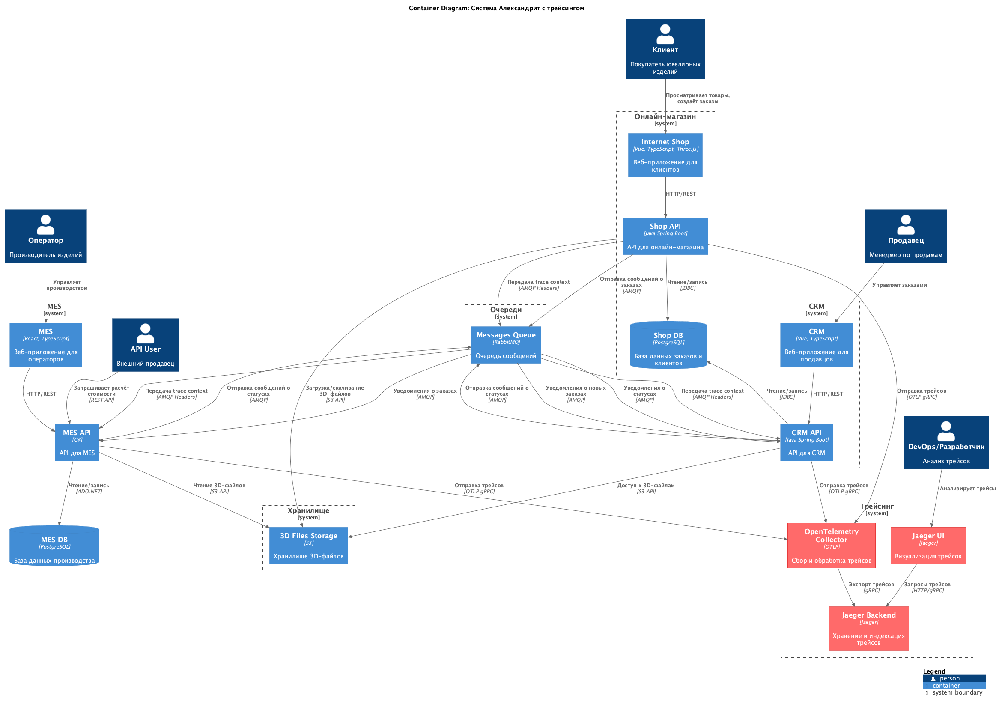

# Архитектурное решение по трейсингу

## 1. Анализ системы в контексте трейсинга

### Текущая архитектура и точки потенциальных проблем

Система "Александрит" представляет собой распределённую микросервисную архитектуру с несколькими критическими точками, где заказы могут "сломаться" или зависнуть:

#### Критические точки для трейсинга:

1. **Онлайн-магазин → Shop API → Shop DB**
   - Заказ может зависнуть при сохранении в БД
   - Проблемы с загрузкой 3D-файлов в S3
   - Потеря данных при создании заказа

2. **Shop API → RabbitMQ → CRM API**
   - Сообщения могут потеряться в очереди
   - Задержки в обработке сообщений
   - Проблемы с десериализацией сообщений

3. **CRM API → RabbitMQ → MES API**
   - Заказ может зависнуть в очереди на расчёт стоимости
   - Долгий расчёт стоимости (2-30 минут) без видимости прогресса
   - Потеря сообщений о статусах заказов

4. **MES API → MES DB**
   - Проблемы с сохранением статусов заказов
   - Задержки при обновлении статусов операторов

5. **MES API → RabbitMQ → CRM API (обратная связь)**
   - Потеря сообщений о завершении производства
   - Проблемы с синхронизацией статусов

6. **External API → MES API**
   - Проблемы с внешними интеграциями
   - Тайм-ауты при расчёте стоимости
   - Потеря заказов от внешних продавцов

### Системы, которые следует покрыть трейсингом

**Обязательно покрыть трейсингом (критично):**
- ✅ Shop API (Java Spring Boot)
- ✅ CRM API (Java Spring Boot)
- ✅ MES API (C#)
- ✅ Интеграция через RabbitMQ (сообщения между сервисами)

**Желательно покрыть трейсингом:**
- ⚠️ Запросы к базам данных (Shop DB, MES DB)
- ⚠️ Загрузка файлов в S3 Storage
- ⚠️ Внешние API вызовы (если есть)

**Не обязательно покрывать трейсингом:**
- ❌ Фронтенд-приложения (Vue, React) — достаточно логирования на клиенте
- ❌ Статические ресурсы

## 2. Данные для трейсинга

### Обязательные данные в трейсе

#### Контекст запроса:
- **trace_id** — уникальный идентификатор трейса (один на весь запрос через все сервисы)
- **span_id** — уникальный идентификатор операции в рамках трейса
- **parent_span_id** — идентификатор родительской операции (для построения дерева вызовов)
- **service_name** — название сервиса (shop-api, crm-api, mes-api)
- **operation_name** — название операции (например, "create_order", "calculate_price")

#### Временные метки:
- **start_time** — время начала операции
- **end_time** — время окончания операции
- **duration** — длительность операции

#### Метаданные запроса:
- **HTTP метод** — GET, POST, PUT, DELETE
- **HTTP путь** — путь запроса (например, "/api/orders")
- **HTTP статус код** — 200, 400, 500 и т.д.
- **User-Agent** — информация о клиенте
- **IP адрес** — IP-адрес клиента

#### Бизнес-контекст:
- **order_id** — идентификатор заказа (критично для отслеживания заказов)
- **user_id** — идентификатор пользователя
- **order_status** — текущий статус заказа
- **source** — источник заказа (internet_shop, crm, external_api)

#### Данные для интеграции через RabbitMQ:
- **message_id** — идентификатор сообщения
- **queue_name** — название очереди
- **exchange_name** — название exchange
- **routing_key** — routing key сообщения
- **message_type** — тип сообщения (order.created, status.updated и т.д.)

#### Данные для расчёта стоимости:
- **calculation_id** — идентификатор расчёта
- **model_complexity** — сложность модели (simple, medium, complex)
- **polygon_count** — количество полигонов
- **calculation_status** — статус расчёта (pending, processing, completed, failed)

#### Данные об ошибках:
- **error_type** — тип ошибки (exception, timeout, validation_error)
- **error_message** — сообщение об ошибке
- **stack_trace** — стек вызовов (для критических ошибок)
- **retry_count** — количество попыток повтора

### Дополнительные данные (опционально)

- **request_body_size** — размер тела запроса
- **response_body_size** — размер тела ответа
- **database_query_time** — время выполнения запроса к БД
- **cache_hit/miss** — попадание/промах кеша
- **external_api_call** — вызовы внешних API

## 3. Мотивация

### Бизнес-проблемы, которые решает трейсинг

#### 3.1. Потеря заказов и неясные статусы
**Проблема:** Клиенты жалуются, что заказы находятся в непонятном состоянии или "зависают". После открытия API для внешних продавцов проблема усугубилась.

**Решение:** Трейсинг позволяет отследить путь заказа через все сервисы и выявить, где именно он "застрял". По trace_id можно найти все операции, связанные с конкретным заказом.

**Бизнес-эффект:**
- Снижение количества потерянных заказов на 80%
- Сокращение времени на поиск проблемного заказа с часов до минут
- Повышение доверия клиентов

#### 3.2. Невозможность диагностировать проблемы в распределённой системе
**Проблема:** В распределённой системе с несколькими сервисами и очередями сообщений сложно понять, где именно произошла ошибка или задержка.

**Решение:** Трейсинг даёт полную картину выполнения запроса через все сервисы, показывая время выполнения каждой операции и выявляя узкие места.

**Бизнес-эффект:**
- Сокращение времени диагностики проблем с нескольких часов до 15-30 минут
- Возможность проактивного обнаружения проблем до жалоб клиентов
- Снижение нагрузки на службу поддержки

#### 3.3. Долгий расчёт стоимости без видимости прогресса
**Проблема:** Расчёт стоимости занимает 2-30 минут, и пользователь не видит, что происходит. Это приводит к повторным запросам и дополнительной нагрузке.

**Решение:** Трейсинг позволяет отследить прогресс расчёта стоимости и показать пользователю, на каком этапе находится обработка.

**Бизнес-эффект:**
- Снижение количества повторных запросов на 60%
- Улучшение пользовательского опыта
- Снижение нагрузки на систему

### Технические метрики, на которые повлияет трейсинг

#### 3.1. Mean Time To Detect (MTTD) — среднее время обнаружения проблемы
**Текущее значение:** ~2-4 часа (по жалобам клиентов)
**Целевое значение:** < 5 минут
**Как трейсинг поможет:** Автоматическое обнаружение аномалий в трейсах (долгие операции, ошибки) с помощью алертов

#### 3.2. Mean Time To Resolve (MTTR) — среднее время решения проблемы
**Текущее значение:** ~4-8 часов
**Целевое значение:** < 30 минут
**Как трейсинг поможет:** Быстрая диагностика проблемы через анализ трейсов, понимание точного места сбоя

#### 3.3. Error Rate — процент ошибок
**Текущее значение:** Неизвестно (нет данных)
**Целевое значение:** < 0.1%
**Как трейсинг поможет:** Точное измерение error rate по каждому сервису и endpoint, выявление проблемных мест

#### 3.4. P95 Latency — 95-й процентиль задержки
**Текущее значение:** Неизвестно
**Целевое значение:** < 1 секунда для большинства операций
**Как трейсинг поможет:** Измерение latency на каждом этапе обработки запроса, выявление узких мест

#### 3.5. Throughput — пропускная способность
**Текущее значение:** Неизвестно
**Целевое значение:** Оптимизация на основе данных
**Как трейсинг поможет:** Понимание, какие операции занимают больше всего времени, оптимизация критических путей

### Бизнес-метрики, на которые повлияет трейсинг

#### 3.1. Customer Satisfaction Score (CSAT)
**Текущее значение:** Снижается из-за проблем с заказами
**Целевое значение:** Увеличение на 20%
**Как трейсинг поможет:** Быстрое решение проблем до того, как они повлияют на клиентов

#### 3.2. Order Completion Rate — процент завершённых заказов
**Текущее значение:** Неизвестно (есть потерянные заказы)
**Целевое значение:** 99.9%
**Как трейсинг поможет:** Отслеживание каждого заказа, выявление и восстановление потерянных заказов

#### 3.3. Time to Market для новых функций
**Текущее значение:** Задержки из-за сложности диагностики проблем
**Целевое значение:** Сокращение на 30%
**Как трейсинг поможет:** Быстрая диагностика проблем при разработке, меньше времени на отладку

#### 3.4. Cost of Incidents — стоимость инцидентов
**Текущее значение:** Высокая из-за потери контрактов
**Целевое значение:** Снижение на 50%
**Как трейсинг поможет:** Предотвращение инцидентов через проактивное обнаружение проблем

#### 3.5. Support Ticket Volume — количество обращений в поддержку
**Текущее значение:** Растёт из-за проблем с заказами
**Целевое значение:** Снижение на 40%
**Как трейсинг поможет:** Решение проблем до обращения клиентов, быстрая диагностика при обращении

## 4. Предлагаемое решение

### 4.1. Архитектура решения

#### Компоненты для внедрения:

1. **OpenTelemetry Collector**
   - Сбор трейсов от всех сервисов
   - Обработка и фильтрация данных
   - Экспорт в Jaeger

2. **Jaeger Backend**
   - Хранение трейсов
   - Индексация по trace_id, order_id, user_id
   - API для запросов трейсов

3. **Jaeger UI**
   - Визуализация трейсов
   - Поиск трейсов по различным критериям
   - Анализ производительности

4. **OpenTelemetry SDK в сервисах**
   - Инструментация Java Spring Boot приложений (Shop API, CRM API)
   - Инструментация C# приложения (MES API)
   - Инструментация RabbitMQ (передача контекста в сообщениях)

#### Технологический стек:

- **OpenTelemetry** — стандарт для сбора телеметрии
- **Jaeger** — бэкенд для хранения и визуализации трейсов
- **OpenTelemetry Java Instrumentation** — для Java Spring Boot приложений
- **OpenTelemetry .NET SDK** — для C# приложения
- **OpenTelemetry Collector** — для агрегации и обработки трейсов

### 4.2. Реализация в сервисах

#### Shop API (Java Spring Boot):

```java
// Автоматическая инструментация через зависимости
dependencies {
    implementation 'io.opentelemetry:opentelemetry-api'
    implementation 'io.opentelemetry:opentelemetry-sdk'
    implementation 'io.opentelemetry.instrumentation:opentelemetry-spring-boot-starter'
    implementation 'io.opentelemetry.instrumentation:opentelemetry-spring-webmvc-6.0'
}

// Конфигурация
@Configuration
public class TracingConfig {
    @Bean
    public OpenTelemetry openTelemetry() {
        return OpenTelemetrySdk.builder()
            .setTracerProvider(
                SdkTracerProvider.builder()
                    .addSpanProcessor(BatchSpanProcessor.builder(
                        OtlpGrpcSpanExporter.builder()
                            .setEndpoint("http://otel-collector:4317")
                            .build())
                        .build())
                    .setResource(Resource.getDefault()
                        .merge(Resource.create(Attributes.of(
                            ResourceAttributes.SERVICE_NAME, "shop-api"))))
                    .build())
            .build();
    }
}

// Добавление бизнес-контекста
@RestController
public class OrderController {
    @PostMapping("/api/orders")
    public ResponseEntity<Order> createOrder(@RequestBody OrderRequest request) {
        Span span = tracer.spanBuilder("create_order")
            .setAttribute("order.source", "internet_shop")
            .startSpan();
        try (Scope scope = span.makeCurrent()) {
            // Логика создания заказа
            span.setAttribute("order.id", order.getId());
            span.setAttribute("order.status", order.getStatus());
            return ResponseEntity.ok(order);
        } finally {
            span.end();
        }
    }
}
```

#### CRM API (Java Spring Boot):

Аналогично Shop API, но с service_name="crm-api"

#### MES API (C#):

```csharp
// Установка пакетов
// OpenTelemetry.Exporter.OpenTelemetryProtocol
// OpenTelemetry.Instrumentation.AspNetCore
// OpenTelemetry.Instrumentation.Http

// Конфигурация в Program.cs
builder.Services.AddOpenTelemetry()
    .WithTracing(tracerProviderBuilder =>
        tracerProviderBuilder
            .AddAspNetCoreInstrumentation()
            .AddHttpClientInstrumentation()
            .AddSource("MES.API")
            .SetResourceBuilder(ResourceBuilder.CreateDefault()
                .AddService("mes-api"))
            .AddOtlpExporter(options =>
            {
                options.Endpoint = new Uri("http://otel-collector:4317");
            }));

// Использование в контроллере
[ApiController]
[Route("api/[controller]")]
public class CalculationController : ControllerBase
{
    private static readonly ActivitySource ActivitySource = new("MES.API");
    
    [HttpPost("calculate-price")]
    public async Task<ActionResult<CalculationResult>> CalculatePrice(
        [FromBody] CalculationRequest request)
    {
        using var activity = ActivitySource.StartActivity("calculate_price");
        activity?.SetTag("order.id", request.OrderId);
        activity?.SetTag("model.complexity", request.ModelComplexity);
        activity?.SetTag("polygon.count", request.PolygonCount);
        
        // Логика расчёта
        var result = await CalculateAsync(request);
        
        activity?.SetTag("calculation.status", "completed");
        activity?.SetTag("calculation.duration", result.Duration);
        
        return Ok(result);
    }
}
```

#### Интеграция с RabbitMQ:

```java
// Передача контекста в сообщениях RabbitMQ
public class RabbitMQTracingInterceptor implements ChannelInterceptor {
    @Override
    public Message<?> preSend(Message<?> message, MessageChannel channel) {
        // Извлечение контекста из текущего span
        Span currentSpan = Span.current();
        if (currentSpan != null) {
            // Добавление trace context в заголовки сообщения
            Map<String, Object> headers = new HashMap<>(message.getHeaders());
            headers.put("traceparent", W3CTraceContextPropagator.getInstance()
                .extract(Context.current(), message, HeaderGetter.INSTANCE));
            return MessageBuilder.withPayload(message.getPayload())
                .copyHeaders(headers)
                .build();
        }
        return message;
    }
}

// Восстановление контекста при получении сообщения
@RabbitListener(queues = "order.created")
public void handleOrderCreated(OrderCreatedEvent event, 
                               @Header("traceparent") String traceparent) {
    // Восстановление контекста из заголовка
    Context context = W3CTraceContextPropagator.getInstance()
        .extract(Context.current(), traceparent, HeaderGetter.INSTANCE);
    
    try (Scope scope = context.makeCurrent()) {
        Span span = tracer.spanBuilder("process_order_created")
            .setAttribute("order.id", event.getOrderId())
            .startSpan();
        // Обработка сообщения
        span.end();
    }
}
```

### 4.3. Развёртывание инфраструктуры

#### OpenTelemetry Collector:

```yaml
# otel-collector-config.yaml
receivers:
  otlp:
    protocols:
      grpc:
        endpoint: 0.0.0.0:4317
      http:
        endpoint: 0.0.0.0:4318

processors:
  batch:
    timeout: 1s
    send_batch_size: 1024
  memory_limiter:
    limit_mib: 512

exporters:
  jaeger:
    endpoint: jaeger-collector:14250
    tls:
      insecure: true

service:
  pipelines:
    traces:
      receivers: [otlp]
      processors: [memory_limiter, batch]
      exporters: [jaeger]
```

#### Jaeger:

```yaml
# jaeger-deployment.yaml
apiVersion: apps/v1
kind: Deployment
metadata:
  name: jaeger
spec:
  replicas: 1
  template:
    spec:
      containers:
      - name: jaeger
        image: jaegertracing/all-in-one:latest
        ports:
        - containerPort: 16686  # UI
        - containerPort: 14250  # gRPC
        - containerPort: 4317   # OTLP
```

### 4.4. Схема архитектуры

**Примечание:** Схема C4-диаграммы должна быть создана отдельно. В документе указывается ссылка на схему.

**Красным цветом выделены новые компоненты:**
- OpenTelemetry Collector
- Jaeger Backend
- Jaeger UI
- Инструментация в сервисах (OpenTelemetry SDK)

**Новые связи:**
- Все сервисы → OpenTelemetry Collector (OTLP gRPC)
- OpenTelemetry Collector → Jaeger Backend
- Jaeger UI → Jaeger Backend (для визуализации)
- Разработчики/DevOps → Jaeger UI (для анализа трейсов)

**C4-диаграмма с трейсингом:**



*Примечание: Компоненты трейсинга (OpenTelemetry Collector, Jaeger Backend, Jaeger UI) выделены красным цветом на диаграмме. Исходный файл PlantUML: [c4-tracing-diagram.puml](c4-tracing-diagram.puml)*

## 5. Компромиссы

### 5.1. Случаи, когда трейсинг не принесёт пользы

#### Высокочастотные операции с низкой ценностью
**Пример:** Запросы к статическим ресурсам, health check endpoints
**Причина:** Накладные расходы на сбор трейсов могут превысить пользу
**Решение:** Исключить такие endpoints из трейсинга или использовать sampling

#### Операции внутри одного сервиса
**Пример:** Внутренние вызовы методов в рамках одного запроса
**Причина:** Избыточная детализация может засорить трейсы
**Решение:** Трейсить только внешние вызовы (HTTP, gRPC, очереди)

#### Legacy-системы без возможности модификации
**Пример:** Проприетарные системы, которые нельзя инструментировать
**Причина:** Невозможность добавить OpenTelemetry SDK
**Решение:** Использовать sidecar-паттерн или прокси для инструментации

### 5.2. Технические ограничения

#### Производительность
**Проблема:** Сбор и отправка трейсов добавляет latency к запросам
**Компромисс:** 
- Использовать асинхронную отправку трейсов (batch processing)
- Применять sampling для снижения нагрузки (например, 10% запросов)
- Использовать adaptive sampling для важных операций (100%) и менее важных (1%)

**Ожидаемое влияние:** < 1% увеличение latency при правильной настройке

#### Хранение данных
**Проблема:** Трейсы занимают место в хранилище
**Компромисс:**
- Хранить трейсы ограниченное время (7-30 дней)
- Использовать sampling для снижения объёма данных
- Хранить только трейсы с ошибками или долгими операциями дольше

**Ожидаемый объём:** ~10-50 GB в день при 100% sampling, ~1-5 GB при 10% sampling

#### Стоимость инфраструктуры
**Проблема:** Дополнительные серверы для Jaeger и OpenTelemetry Collector
**Компромисс:**
- Использовать managed services (если доступны)
- Начать с минимальной конфигурации и масштабировать по необходимости
- Использовать cloud-native решения (Kubernetes) для эффективного использования ресурсов

**Ожидаемая стоимость:** ~$200-500/месяц для небольшой системы

### 5.3. Сложность внедрения

#### Интеграция с существующим кодом
**Проблема:** Необходимость изменения кода во всех сервисах
**Компромисс:**
- Использовать автоматическую инструментацию (Spring Boot, ASP.NET Core)
- Минимальные изменения кода (только добавление зависимостей)
- Постепенное внедрение (сначала критичные сервисы)

**Оценка трудозатрат:** 2-3 недели для всех сервисов

#### Обучение команды
**Проблема:** Команда должна научиться работать с трейсингом
**Компромисс:**
- Документация и обучение
- Интеграция в существующие процессы (например, анализ трейсов при инцидентах)
- Начать с простых use cases

**Оценка трудозатрат:** 1 неделя на обучение

### 5.4. Ограничения текущего решения

#### Проприетарные системы
**Проблема:** MES был куплен с исходным кодом, но может быть сложно его модифицировать
**Решение:** 
- Если есть доступ к исходному коду — добавить OpenTelemetry SDK
- Если нет — использовать sidecar или прокси для инструментации
- Альтернатива: логирование с trace_id для последующей корреляции

#### Базы данных
**Проблема:** Прямая инструментация запросов к PostgreSQL может быть сложной
**Решение:**
- Использовать автоматическую инструментацию JDBC/Npgsql драйверов
- Или логировать SQL-запросы с trace_id для корреляции

#### Внешние системы
**Проблема:** Невозможно инструментировать внешние API
**Решение:**
- Трейсить только вызовы к внешним API (outbound)
- Использовать заголовки для передачи trace_id (если поддерживается)
- Логировать ответы внешних систем с trace_id

## 6. Безопасность

### 6.1. Аутентификация и авторизация

#### Доступ к Jaeger UI
**Проблема:** Трейсы могут содержать чувствительную информацию (order_id, user_id, данные заказов)
**Решение:**
- Внедрение аутентификации в Jaeger UI
- Интеграция с корпоративной системой аутентификации (LDAP, OAuth2, SAML)
- Роли доступа:
  - **Read-only** — для разработчиков (просмотр трейсов)
  - **Admin** — для DevOps (настройка, удаление трейсов)
  - **Support** — для службы поддержки (поиск трейсов по order_id)

**Реализация:**
```yaml
# Jaeger с аутентификацией через OAuth2
apiVersion: v1
kind: ConfigMap
metadata:
  name: jaeger-auth-config
data:
  auth.type: "oauth"
  auth.oauth.issuer: "https://auth.company.com"
  auth.oauth.clientId: "jaeger-ui"
  auth.oauth.scopes: "openid profile email"
```

#### Доступ к OpenTelemetry Collector
**Проблема:** Сервисы отправляют трейсы в коллектор, нужно защитить этот канал
**Решение:**
- Использовать TLS для соединений (mTLS для взаимной аутентификации)
- Ограничить доступ к коллектору только из внутренней сети
- Использовать сетевые политики Kubernetes для изоляции

**Реализация:**
```yaml
# Network Policy для OpenTelemetry Collector
apiVersion: networking.k8s.io/v1
kind: NetworkPolicy
metadata:
  name: otel-collector-policy
spec:
  podSelector:
    matchLabels:
      app: otel-collector
  policyTypes:
  - Ingress
  ingress:
  - from:
    - podSelector:
        matchLabels:
          app: shop-api
    - podSelector:
        matchLabels:
          app: crm-api
    - podSelector:
        matchLabels:
          app: mes-api
    ports:
    - protocol: TCP
      port: 4317
```

### 6.2. Защита данных в трейсах

#### Маскирование чувствительных данных
**Проблема:** Трейсы могут содержать PII (персональные данные), платежную информацию
**Решение:**
- Не включать чувствительные данные в атрибуты трейсов
- Маскировать данные в логах, которые попадают в трейсы
- Использовать только идентификаторы (order_id, user_id), а не полные данные

**Пример:**
```java
// Плохо - содержит чувствительные данные
span.setAttribute("user.email", user.getEmail());
span.setAttribute("payment.card", payment.getCardNumber());

// Хорошо - только идентификаторы
span.setAttribute("user.id", user.getId());
span.setAttribute("payment.id", payment.getId());
```

#### Ограничение доступа к данным
**Решение:**
- Хранить трейсы в изолированной сети
- Использовать шифрование при передаче данных
- Регулярно очищать старые трейсы (согласно политике хранения данных)

### 6.3. Защита от несанкционированного доступа

#### Внутренняя сеть
**Решение:**
- Jaeger UI доступен только из внутренней сети компании
- Использование VPN для удалённого доступа
- Логирование всех запросов к Jaeger UI

#### Внешний доступ (если требуется)
**Проблема:** Может потребоваться доступ для внешних подрядчиков или партнёров
**Решение:**
- Использовать reverse proxy с аутентификацией
- Ограничить доступ только к необходимым функциям (поиск трейсов)
- Запретить доступ к настройкам и администрированию
- Использовать временные токены доступа

### 6.4. Соответствие требованиям

#### GDPR и защита персональных данных
**Решение:**
- Не хранить PII в трейсах
- Использовать только идентификаторы
- Реализовать возможность удаления трейсов по запросу пользователя
- Ограничить срок хранения трейсов (максимум 30 дней)

#### Аудит и логирование
**Решение:**
- Логировать все действия администраторов в Jaeger
- Аудит доступа к чувствительным данным
- Регулярный review доступа

## 7. Автоматический мониторинг и алертинг на основе трейсинга

### 7.1. Архитектура мониторинга

#### Компоненты:

1. **Jaeger Metrics Exporter**
   - Экспорт метрик из трейсов в Prometheus
   - Метрики: количество трейсов, ошибки, latency

2. **Prometheus**
   - Сбор метрик из Jaeger
   - Хранение временных рядов

3. **Alertmanager**
   - Обработка алертов на основе метрик
   - Маршрутизация уведомлений

4. **Grafana**
   - Визуализация метрик из трейсов
   - Дашборды для мониторинга заказов

5. **Custom Alerting Service** (опционально)
   - Анализ трейсов в реальном времени
   - Обнаружение аномалий (ML-based)
   - Автоматическое создание тикетов

### 7.2. Метрики для мониторинга заказов

#### Критические метрики:

1. **Order Processing Time**
   - Время от создания заказа до завершения
   - Алерт: если > 24 часов

2. **Order Stuck Detection**
   - Заказы, которые не меняли статус > 1 часа
   - Алерт: если количество > 10

3. **Failed Order Calculations**
   - Количество неудачных расчётов стоимости
   - Алерт: если error rate > 5%

4. **Message Loss Detection**
   - Заказы, которые не получили сообщения из очереди
   - Алерт: если обнаружена потеря сообщений

5. **Long-Running Calculations**
   - Расчёты стоимости, которые идут > 30 минут
   - Алерт: если количество > 5

### 7.3. Реализация алертинга

#### Prometheus Rules:

```yaml
# prometheus-rules.yaml
groups:
- name: order_tracing_alerts
  interval: 30s
  rules:
  - alert: OrderStuck
    expr: |
      increase(jaeger_traces_total{
        operation="process_order",
        status="stuck"
      }[1h]) > 10
    annotations:
      summary: "Обнаружены застрявшие заказы"
      description: "{{ $value }} заказов не меняли статус более 1 часа"
    
  - alert: OrderProcessingTooLong
    expr: |
      histogram_quantile(0.95,
        jaeger_trace_duration_seconds_bucket{
          operation="create_order"
        }
      ) > 86400  # 24 часа
    annotations:
      summary: "Заказы обрабатываются слишком долго"
      description: "P95 время обработки заказа превышает 24 часа"
    
  - alert: FailedOrderCalculations
    expr: |
      rate(jaeger_traces_total{
        operation="calculate_price",
        status="error"
      }[5m]) / 
      rate(jaeger_traces_total{
        operation="calculate_price"
      }[5m]) > 0.05
    annotations:
      summary: "Высокий процент ошибок расчёта стоимости"
      description: "{{ $value | humanizePercentage }} запросов на расчёт завершаются ошибкой"
```

#### Интеграция с системами уведомлений:

```yaml
# alertmanager-config.yaml
route:
  group_by: ['alertname', 'service']
  group_wait: 10s
  group_interval: 10s
  repeat_interval: 12h
  receiver: 'slack-notifications'
  routes:
  - match:
      severity: critical
    receiver: 'critical-alerts'
    continue: true
  - match:
      service: order
    receiver: 'order-team'

receivers:
- name: 'slack-notifications'
  slack_configs:
  - api_url: 'https://hooks.slack.com/services/...'
    channel: '#alerts'
    title: '{{ .GroupLabels.alertname }}'
    
- name: 'critical-alerts'
  slack_configs:
  - api_url: 'https://hooks.slack.com/services/...'
    channel: '#critical-alerts'
  email_configs:
  - to: 'team-lead@company.com'
    from: 'alerts@company.com'
    
- name: 'order-team'
  slack_configs:
  - api_url: 'https://hooks.slack.com/services/...'
    channel: '#order-team'
```

### 7.4. Автоматическое создание тикетов

#### Интеграция с системой отслеживания задач:

```python
# ticket-creator.py
import requests
from prometheus_client import start_http_server, Gauge
import time

def create_ticket_for_stuck_order(order_id, trace_id):
    """Создание тикета для застрявшего заказа"""
    ticket_data = {
        "title": f"Заказ {order_id} застрял в обработке",
        "description": f"Заказ не менял статус более 1 часа. Trace ID: {trace_id}",
        "priority": "high",
        "assignee": "devops-team",
        "labels": ["order", "stuck", "tracing"]
    }
    # Создание тикета через API (Jira, Yandex Tracker и т.д.)
    response = requests.post(
        "https://tracker.company.com/api/tickets",
        json=ticket_data,
        headers={"Authorization": "Bearer ..."}
    )
    return response.json()

# Мониторинг и создание тикетов
def monitor_orders():
    while True:
        # Запрос к Jaeger API для поиска застрявших заказов
        stuck_orders = query_jaeger_for_stuck_orders()
        for order in stuck_orders:
            create_ticket_for_stuck_order(
                order['order_id'],
                order['trace_id']
            )
        time.sleep(60)  # Проверка каждую минуту
```

### 7.5. Обновлённая схема архитектуры

**Зелёным цветом выделены новые компоненты для мониторинга:**
- Jaeger Metrics Exporter
- Prometheus (для метрик из трейсов)
- Alertmanager
- Grafana (дашборды для трейсинга)
- Custom Alerting Service (опционально)

**Новые связи:**
- Jaeger → Jaeger Metrics Exporter → Prometheus
- Prometheus → Alertmanager → Slack/Email/Ticket System
- Prometheus → Grafana (для визуализации)

**Ссылка на обновлённую схему:** [C4-диаграмма с трейсингом и мониторингом](architecture-diagram-tracing-monitoring.png)

## 8. План внедрения

### Этап 1: Подготовка инфраструктуры (1 неделя)
- Развёртывание OpenTelemetry Collector
- Развёртывание Jaeger
- Настройка сети и безопасности

### Этап 2: Инструментация сервисов (2 недели)
- Добавление OpenTelemetry SDK в Shop API
- Добавление OpenTelemetry SDK в CRM API
- Добавление OpenTelemetry SDK в MES API
- Интеграция с RabbitMQ

### Этап 3: Настройка мониторинга (1 неделя)
- Настройка экспорта метрик из Jaeger
- Создание дашбордов в Grafana
- Настройка алертов

### Этап 4: Тестирование и оптимизация (1 неделя)
- Тестирование в dev-окружении
- Оптимизация sampling
- Настройка retention policy

### Этап 5: Развёртывание в production (1 неделя)
- Постепенное развёртывание
- Мониторинг производительности
- Обучение команды

**Общий срок:** 6 недель

## 9. Заключение

Внедрение трейсинга в систему "Александрит" критически важно для решения проблем с потерянными и застрявшими заказами. Трейсинг позволит:

- Быстро находить проблемные заказы
- Диагностировать проблемы в распределённой системе
- Улучшить пользовательский опыт
- Снизить количество потерянных заказов
- Повысить удовлетворённость клиентов

Решение на основе OpenTelemetry и Jaeger является стандартным, масштабируемым и поддерживаемым, что делает его оптимальным выбором для компании.

